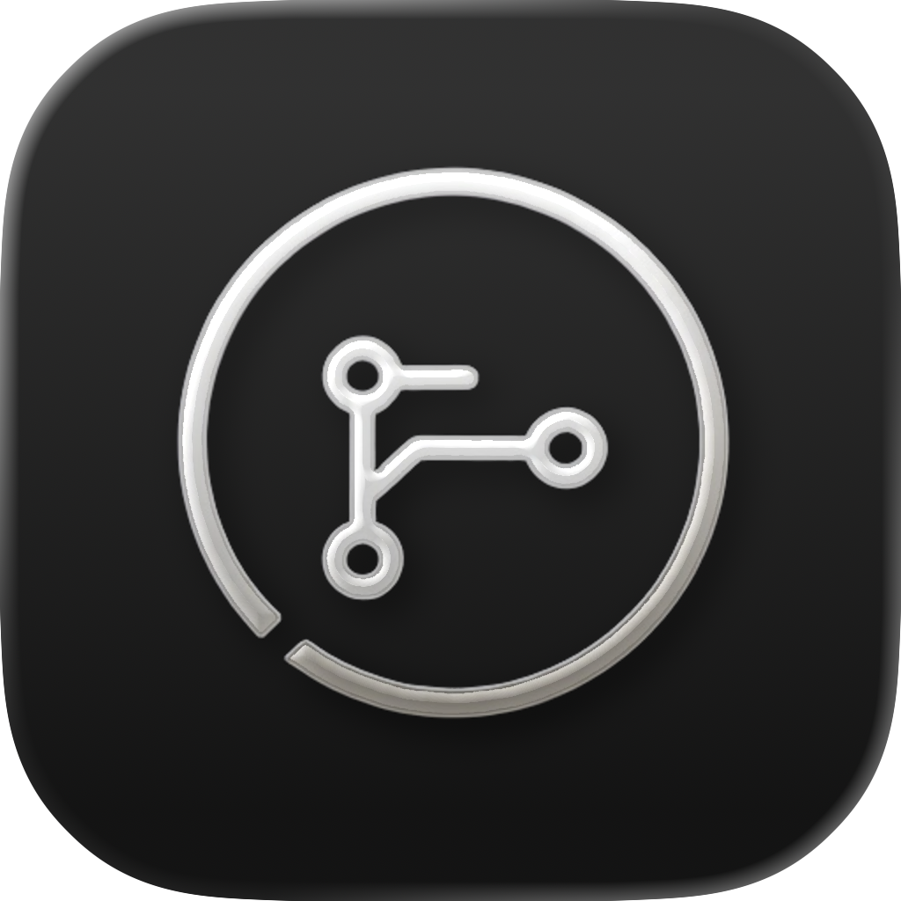
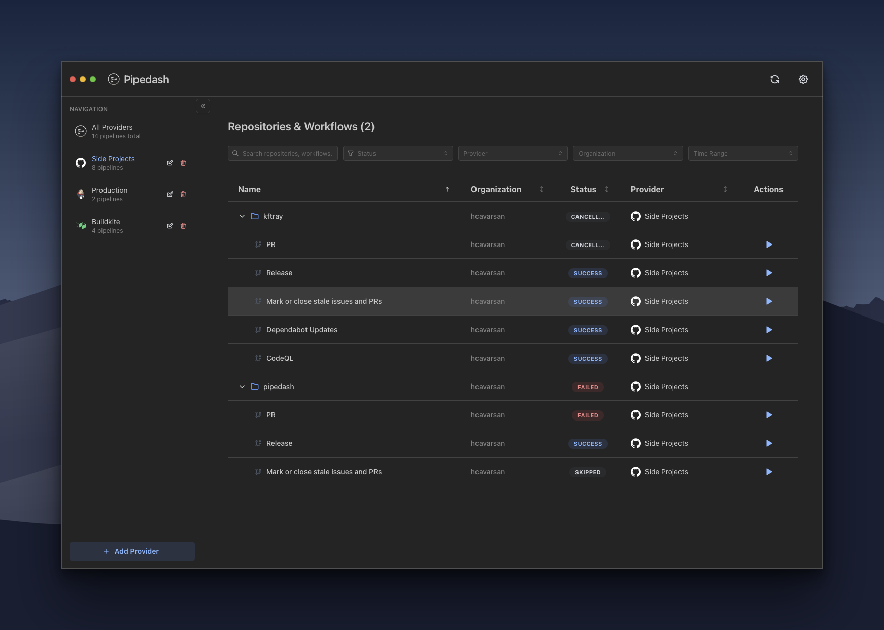
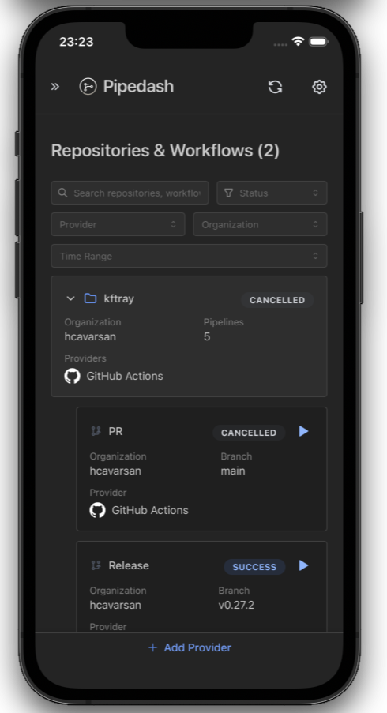

<div align="center">
  <br>
  
  <h1>Pipedash</h1>
  <p>A desktop app for managing CI/CD pipelines from multiple providers </p>

</div>

<p align="center">
<div align="center">

</div>
</p>

> **[WIP]** This is an work-in-progress project. It works for basic use cases but hasn't been thoroughly tested. Things might break, APIs might change, and there are probably bugs. Tested primarily on macOS – not sure if it works properly on Linux and Windows due to webview differences.

## About

Pipedash aggregates CI/CD pipelines from multiple providers into a single desktop interface. Instead of switching between GitHub Actions, Buildkite, and Jenkins dashboards, view everything in one place.

Built with Tauri, Rust, React, and TypeScript.

## Why

Most development teams use multiple CI/CD platforms over time. Open source projects often use GitHub Actions, internal services might run on Buildkite, and there's usually some Jenkins instance handling legacy systems. Checking everything means opening multiple tabs and manually refreshing.

This tool pulls pipeline data from different providers and shows it together.

## Supported Providers

- GitHub Actions
- Buildkite
- Jenkins

The plugin architecture allows adding more providers.

## What It Does

The app polls configured providers and displays pipelines organized by repository and workflow. Background refresh runs every X seconds (configurable per provider). When pipeline status changes, the UI updates automatically.

Main capabilities:
- View pipeline status across multiple providers
- Browse run history with commit info and execution times
- Trigger workflows with parameters dynamically loaded from each provider
- Re-run previous executions with the same parameters
- Cancel running builds
- Multiple instances of the same provider type

When triggering or re-running a workflow, the app fetches available parameters directly from the provider plugin (workflow inputs for GitHub Actions, build parameters for Jenkins, etc.) and displays them in a form.

**Privacy First**

Everything runs locally on the machine. The app only connects to configured CI/CD providers – no analytics, telemetry, or third-party services. Pipeline data is stored in a local SQLite database and API tokens are encrypted in the system keyring.

## Installation

Download the latest release for your platform from the [releases page](https://github.com/hcavarsan/pipedash/releases).

Available for macOS, Windows, and Linux.

## Setup

Launch the app and add a provider via the sidebar. Each provider needs an API token:

**GitHub Actions**: Personal Access Token with `repo` and `workflow` scopes. Optionally set a custom base URL for GitHub Enterprise.

**Buildkite**: API Access Token with read permissions and the organization slug.

**Jenkins**: API token, username, and server URL.

After adding a provider, the app validates credentials and fetches available repositories. Select which ones to monitor and save. Pipelines will appear in the main view and refresh automatically.

## How It Works

**Store**

Provider configurations are stored in a local SQLite database. Tokens are kept separate in the system keyring.

Each provider has its own refresh interval (default: 30 seconds), adjustable based on API rate limits.


**Plugin System**

Each CI/CD provider is implemented as a plugin that exposes a common interface. The core application doesn't know the specifics of how GitHub or Buildkite work it just calls standard methods like `fetch_pipelines()` or `trigger_pipeline()` and the plugin handles the details.

Plugins are compiled into the application at build time, not loaded dynamically at runtime. This keeps things simpler and avoids the security concerns of runtime plugin loading.

When the app starts, it loads cached pipeline data from SQLite immediately. In the background, a refresh loop polls each provider's API and updates the cache when changes are detected. The frontend listens for events and re-renders when new data arrives.

## Adding Providers

To add support for a new CI/CD platform, create a new crate in `crates/pipedash-plugin-{name}/` and implement the `Plugin` trait from `pipedash-plugin-api`. The trait defines methods for fetching pipelines, validating credentials, triggering builds, and retrieving run history.

After implementing the plugin, register it in the main application's plugin registry and add any provider-specific configuration UI in the frontend.

The existing GitHub, Buildkite, and Jenkins plugins serve as reference implementations.


## Development

The project uses [mise](https://mise.jdx.dev) for development environment and task management.

```bash
curl https://mise.run | sh

git clone https://github.com/hcavarsan/pipedash.git
cd pipedash

mise install
mise run install

mise run dev
```

### Development Workflow

**Initial Setup** (first time only):

-  Install OS-specific Tauri prerequisites (see https://tauri.app/start/prerequisites/#system-dependencies)
-  `mise install` installs development tools: Rust nightly (with clippy, rustfmt), Node 24, Bun
-  `mise run install` installs project dependencies: npm packages including @tauri-apps/cli
-  Ready to develop
- `mise run dev` starts the app with hot reload enabled


**Available Commands**:

```bash

# runs full desktop app with hot reload
mise run dev

# runs only ui in dev mode, just here for convenience
mise run ui

# runs tauri in ios emulator
mise run dev:ios

# runs tauri in android emulator
mise run dev:android

# build tauri artifacts
mise run build

# build only frontend
mise run build:front

# build  cargo
mise run build:back

# build ios artifacts
mise run build:ios

#
mise run build:android

# format code
mise run format
mise run format:front
mise run format:back

# lint code
mise run lint
mise run lint:front
mise run lint:back


# run lint and fmt checks
mise run check
mise run check:front
mise run check:back

# run checks and build of tauri
mise run release
```


## Roadmap

**Additional Providers**
- [x] GitLab CI
- [ ] CircleCI
- [ ] Azure Pipelines
- [ ] Travis CI
- [ ] Drone CI
- [ ] ArgoCD

**Features**
- [x] Build duration metrics
- [ ] Log viewing within the app (currently opens external links)
- [ ] Auto-updater for releases


**Platforms** (maybe)

- [ ] Android app
- [ ] iOS app (tested locally in simulator, needs polish for store release), current state:
<p align="center">
<div align="center">

</div>
</p>


No timeline on these. They'll happen if there's need for them and time to implement.

## Contributing

This is an open source project. Bug reports, feature requests, and pull requests are welcome. If there's a specific CI/CD provider that would be useful, opening an issue or contributing a plugin implementation would be helpful.

No formal contribution guidelines yet since the project is still finding its shape.

## License

GPL 3.0 License. See [LICENSE](LICENSE) for details.

